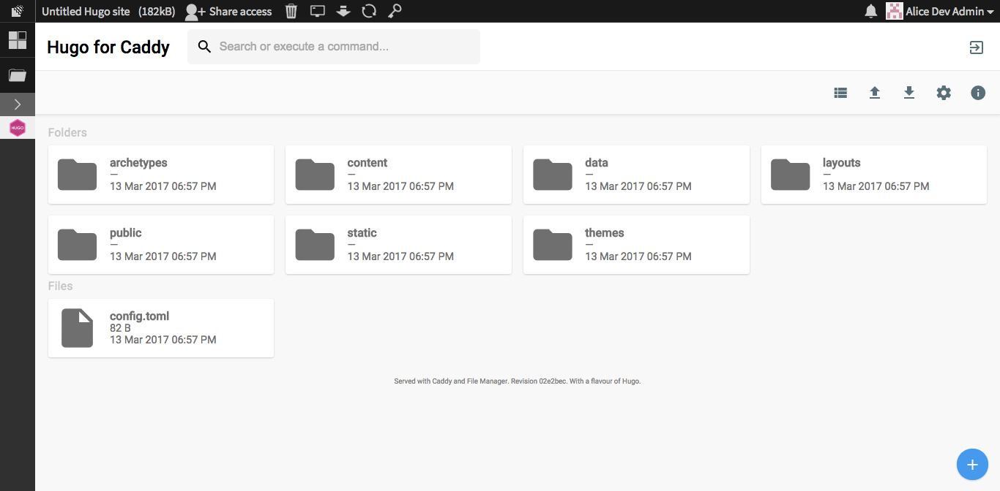

Hugo Sandstorm package
===========================

This is the [Sandstorm](https://sandstorm.io) package of [Hugo](https://gohugo.io/).



# How to

The package is done with [vagrant-spk](https://github.com/sandstorm-io/vagrant-spk), a tool designed to help app developers package apps for [Sandstorm](https://sandstorm.io).

You can follow the below mentioned steps to make your own package or to contribute.

## Prerequisites

You will need to install:
- [Vagrant](https://www.vagrantup.com/)
- [VirtualBox](https://www.virtualbox.org/wiki/Downloads)
- Git

## Step by Step

```
git clone https://github.com/sandstorm-io/vagrant-spk
git clone https://github.com/ndarilek/hugo-sandstorm
export PATH=$(pwd)/vagrant-spk:$PATH
cd hugo-sandstorm
vagrant-spk vm up
vagrant-spk dev
```

visit [http://local.sandstorm.io:6080/](http://local.sandstorm.io:6080/) in a web browser

Note: when you want to fork this repo and create actual app packages for the app store you would need either the original app key or create a new one and make your own version of the app.
